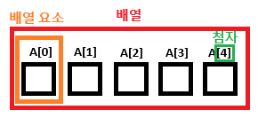
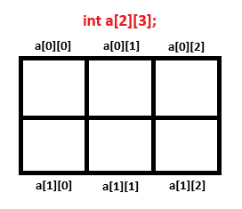

## 배열이란?


- 여러 개의 변수를 동시에 만들어서 여러 개의 값을 처리하는데 유용

- 반복문과 함께 여러 개의 값을 입력 받거나 출력하거나 처리할 때 유용

- 첨자는 1부터가 아니라 0부터 → a[n]일 경우 0 ~ n-1

- 정수형 뿐만 아니라 실수형, 문자형 모두 배열 사용 가능

## 학생 5명의 점수 입력 받아 저장 후 출력

```c++
int a[5];
int i;

for (i=0; i<5; i++) {
	scanf("%d", %a[i]);
}

for (i=0; i<5; i++) {
	printf("%d", a[i]);
}
```

## 배열의 초기화

- 처음 한 번은 한꺼번에 저장 가능 → 배열의 초기화

    - int a[5] = {2, 5, 4, 3, 0};

    - 배열 선언 이후에는 할 수 없음

- 초기화 값을 기술하지 않은 부분은 0으로 채움

    - int a[5] = {5, 6}; → 5, 6, 0, 0, 0

- 모든 배열 요소들에 대해 초기화 값을 기술해주면 배열 크기 생략 가능

    - int a[] = {3, 2, 7, 5} → 3, 2, 7, 5

## 2차원 배열


