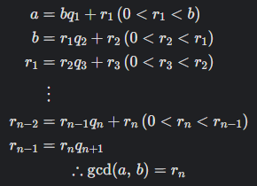

## 문제

[object Promise]## 유클리드 호제법

- 두 양의 정수 a, b (a > b)에 대하여 a = bq + r (0 ≤ r < b)이라 하면

    - a, b의 최대공약수는 b, r의 최대공약수와 같음

- 즉, gcd⁡(a, b) = gcd⁡(b, r)

- r이 0이라면 a, b의 최대공약수는 b


```c++
int euclidean(int a, int b) {
    while (b != 0) {
        int r = b;	// b의 값을 r에 저장
        b = a % b;	// a를 b로 나눈 나머지를 b에 저장
        a = r;			// a에 r의 값(b의 초기값)을 저장
    }								// 최대공약수가 될 때까지 반복
    return a;
}
```

## 풀이

```c++
#include <stdio.h>
#include <stdbool.h>
#include <stdlib.h>

int euclidean(int a, int b) {
    while (b != 0) {
        int r = b;
        b = a % b;
        a = r;
    }
    return a;
}

int* solution(int numer1, int denom1, int numer2, int denom2) {
    // return 값은 malloc 등 동적 할당을 사용해주세요. 할당 길이는 상황에 맞게 변경해주세요.
    int* answer = (int*)malloc(2 * sizeof(int));

    int numer = numer1 * denom2 + numer2 * denom1;
    int denom = denom1 * denom2;

    int gcd = euclidean(numer, denom);

    answer[0] = numer / gcd;
    answer[1] = denom / gcd;

    return answer;
```

