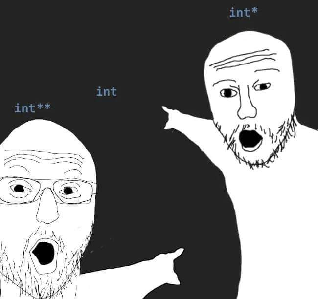

## 포인터

- 변수의 설정 = 메모리에서 변수로 사용할 공간을 할당 받음

- 메모리: 값 등을 저장할 수 있는 공간

- 메모리 주소: 메모리의 각 byte 공간에는 주소라는 번호가 붙어있음

- 변수의 주소: 변수를 차지하고 있는 공간들의 주소들 중 가장 작은 것

- 주소 연산자 &: 변수의 주소가 결과값

- **포인터**: 변수의 주소를 저장할 수 있는 변수

- 간접 지정 연산자 \*: 포인터에 들어 있는 주소가 가리키는 그 공간(대상체)

#### $$ 포인터의 대입

```c++
int a;
double b;
int *c;
double *d;

c = &a;
d = &b;
```

### 포인터의 자료형

- 포인터는 가리키는 대상의 자료형으로 자료형을 구분

- 가리키는 대상이 다르면 대입하지 말 것

- 의도적으로 한다면 형변환 연산자 사용

```c++
int a, *c;
double b, *d;
c = &a;
d = &b;
c = (int *)&b;
```

### 포인터의 활용

- 함수: 참조에 의한 호출 모사

- 배열

- 자료구조

- 문자열

- 파일 입출력

## 두 변수의 값을 바꾸는 함수

```c++
include <stdio.h>

void swap(int *a, int *b) {
    int tmp;
    tmp = *a;
    *a = *b;
    *b = tmp;
    return;
}

int main(void) {
    int x, y

    x = 8;
    y = 12;
    swap(&x, &y);
    ...
}
```

## 합과 차를 구하는 함수

```c++
void sum_diff(int a, int b, int *c, int *d) {
    *c = a + b;
    *d = a - b;
    return;
}

int main(void) {
    int x, y;
    int p, m;

    x = 8;
    y = 12;
    sum_diff(x, y, &p, &m);
    ...
}
```

- 포인터를 통해 함수가 반환값이 2개 이상인 것처럼 동작하게 할 수 있음

## 포인터 + 선택 정렬

```c++
#include <stdio.h>

void swap(int* a, int* b) {
    int tmp;
    tmp = *a;
    *a = *b;
    *b = tmp;
    return;
}

int main(void) {
    int i, j, a[10];
    int min, idx;

    for (i = 0; i < 10; i++) {
        scanf_s("%d", &a[i]);
    }

    for (i = 0; i < 9; i++) {
        min = a[i];
        idx = i;
        for (j = i; j < 10; j++) {
            if (a[j] < min) {
                min = a[j];
                idx = j;
            }
        }
        swap(&a[i], &a[idx]);
    }

    for (i = 0; i < 10; i++) {
        printf("%d\\n", a[i]);
    }
}
```


