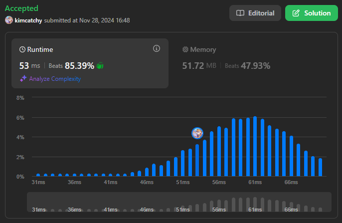

## 문제

Write a function **createCounter**. It should accept an initial integer **init**. It should return an object with three functions.

The three functions are:

- **increment()** increases the current value by 1 and then returns it.

- **decrement()** reduces the current value by 1 and then returns it.

- **reset()** sets the current value to **init** and then returns it.

### 출력 예시

#### Example 1:

[object Promise]    Output: \[6,5,4\]

    Explanation:

    const counter = createCounter(5);

    counter.increment(); // 6

    counter.reset(); // 5

    counter.decrement(); // 4

#### Example 2:

[object Promise]    Output: \[1,2,1,0,0\]

    Explanation:

    const counter = createCounter(0);

    counter.increment(); // 1

    counter.increment(); // 2

    counter.decrement(); // 1

    counter.reset(); // 0

    counter.reset(); // 0

## 풀이

```javascript
/**
 * @param {integer} init
 * @return { increment: Function, decrement: Function, reset: Function }
 */
var createCounter = function(init) {
    let i = init
    return {
        increment: function() {
            return ++i
        },
        decrement: function() {
            return --i
        },
        reset: function() {
            return i = init
        }
    }
};
```

- return하기 전에 값이 증가 → [전위연산자](https://kimcatchy.github.io/prefix-postfix) 사용


