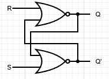
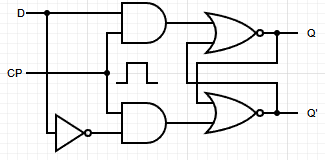
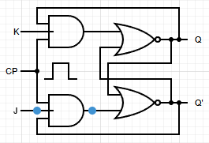
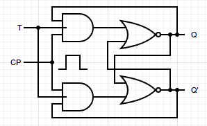

## 플립플롭

- 1비트의 정보를 기억할 수 있는 회로로 컴퓨터의 캐시 메모리·레지스터를 구성하는 기본 회로

- 전원이 있을 때만 기억이 유지되며, 전원이 차단되면 정보는 사라지는 휘발성 기억 소자

### 래치(Latch)

- 수동적 또는 전자적 조작으로 상태를 바꾸지 않는 한 그 상태를 유지해 주는 장치 또는 회로

- 주어진 상태를 보관 유지할 수 있도록 NAND 게이트 또는 NOR 게이트를 이용하여 회로를 구성

- 논리 회로로 구성되었기 때문에 논리회로에 준하는 빠른 동작속도를 얻을 수 있고 플립플롭으로 활용

### 기본적인 플립플롭

- 플립플롭과 래치는 두 개의 안정된 상태 중 하나를 가지는 1비트 기억 소자

- 플립플롭과 래치도 게이트로 구성되지만 조합논리회로와 달리 궤환(feedback)이 있음

- 래치회로는 근본적으로는 플립플롭과 유사한 기능을 수행

### NOR 게이트로 구성된 S-R 래치

| **S** | **R** | **Q** | **Q'** |
| --- | --- | --- | --- |
| 0 | 0 | 불변 | 불변 |
| 0 | 1 | 0 | 1 |
| 1 | 0 | 1 | 0 |
| 1 | 1 | 불능 | 불능 |

### D 플립플롭

| **CP** | **D** | **Q** | **Q'** |
| --- | --- | --- | --- |
| 1 | 0 | 0 | 1 |
| 1 | 1 | 1 | 0 |

- 입력 단자 R과 S에 동시에 1이 입력되어 불능이 되는 것을 회로적으로 차단

- 입력신호 D가 클럭펄스(CP)에 의해 변화 없이 그대로 출력에 전달되는 특성을 가지고 있어, 데이터(Data)를 전달하는 것과 지연(Delay)을 의미하는 D 플립플롭이라고 함

### J-K 플립플롭

- R-S 플립플롭에서 R과 S에 동시에 1이 입력되어 불능 상태가 되는 것을 해결한 논리회로

- J는 S에, K는 R에 대응하는 입력으로 J와 K의 입력이 동시에 1이 입력되면 플립플롭의 출력은 이전 출력의 보수 상태로 변화

### T 플립플롭

- J-K 플립플롭의 J와 K 입력을 묶어서 하나의 입력 신호 T로 동작시키는 플립플롭

- 입력이 0이 되면 이전 상태의 값이 그대로 출력되고, 입력이 1이 되면 이전 상태의 보수 값이 출력되게 되는 플립플롭

