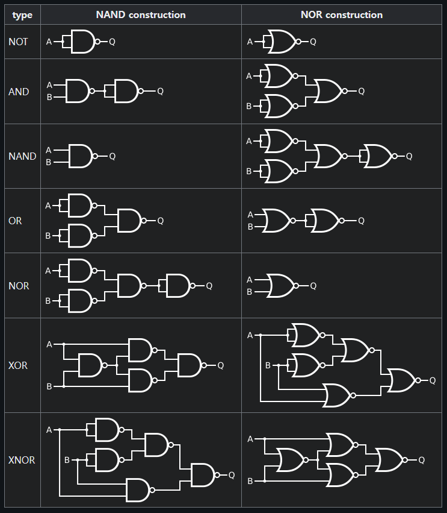

## 논리 회로

- 2진수의 논리연산을 수행하는 회로

- 논리게이트의 동작은 수학적으로 부울 대수로 표현 가능

- 게이트의 입력과 출력 관계는 진리표로 나타냄

- **AND**: 모든 입력이 1인 경우에만 1을 출력하고 나머지의 경우에는 0을 출력

    - 마스크 연산

- **OR**: 입력 중 하나라도 1이라면 1을 출력하고 모두 0이라면 0을 출력

    - 선택적-세트 연산

- **NOT**: 입력값에 대해 출력값이 반대가 되도록 함

- **XOR**: 여러 개의 입력 중에서 1의 개수가 홀수로 입력되면 1을 출력

    - 선택적-보수 연산

    - 비교 연산

- **NAND**: AND + NOT, AND의 출력과 반대로 출력, 모든 입력이 1인 경우에만 0을 출력하고 나머지는 1을 출력

    - Negative-OR

- **NOR**: OR + NOT, 여러 개의 입력 중 최소한 하나 이상의 입력이 1을 갖는 경우 0을 출력

    - Negative-AND

- **XNOR**: XOR + NOT, 여러 개의 입력 중에서 1의 개수가 홀수로 입력되면 0을 출력

### 범용 논리 게이트

- **NAND**와 **NOR** 게이트로 디지털 시스템에서 사용되는 모든 논리 게이트를 구성할 수 있음

- 유니버셜 게이트 또는 범용 게이트라고 함

## 불 대수

- 인간의 사고과정을 수학적으로 해석한 것

- 임의의 명제가 참인지를 판명하기 때문에 논리 대수라고도 함

- 변수들의 진리표 관계를 대수식으로 표현하기 용이

    - 동일한 성능을 갖는 더 간단한 회로 만들기에 편리

### 불 대수의 기본 법칙

- **교환법칙**

    - 입력들의 순서가 변경되더라도 논리 연산의 결과는 동일하게 출력

    - A·B = B·A

    - A+B = B+A

- **결합법칙**

    - 세 입력이 동일한 논리 연산을 수행할 때, 입력의 순서가 바뀌어 연산이 수행되어도 결과는 동일함

    - A·(B·C) = (A·B)·C

    - A+(B+C) = (A+B)+C

- **분배법칙**

    - A·(B+C) = A·B + A·C

- **다중 부정**

    - 논리 부정이 여러 번 수행되는 것

- **드모르간의 법칙**

    - 여러 논리 변수의 논리합 전체를 부정(NOR)하면 그것은 원래의 논리 변수를 각각 부정한 것을 논리곱한 것과 같음

    - 여러 논리 변수의 논리곱 전체를 부정(NAND)하면 그것은 원래의 논리 변수를 각각 부정한 것을 논리합한 것과 같음

### 불 대수의 기본 정리

- +는 합집합, ·는 교집합, NOT은 여집합이라고 생각하면 됨

- A+0 = A

- A+1 = 1

- A·0 = 0

- A·1 = A

- A+A = A

- A+Ā = 1

- A·A = A

- A·Ā = 0

- A'' = A (A 위에 바 2개..)

- A+AB = A

- A+ĀB = A+B

- (A+B)·(A+C) = A+BC

### 불 대수의 표준형

- **최소항**

    - 변수들이 AND로 결합된 것

    - 변수 값이 참(1)인 경우는 정상형태인 A, B, C의 형태를 사용

    - 변수 값이 거짓(0)인 경우는 보수형태인 Ā, B̄, C̄의 형태를 사용

    - 표준 곱의 항이라고 함

- **최대항**

    - 변수들이 OR로 결합된 것

    - 변수 값이 참(1)인 경우는 보수형태인 Ā, B̄, C̄의 형태를 사용

    - 변수 값이 거짓(0)인 경우는 정상형태인 A, B, C의 형태를 사용

    - 표준 합의 항이라고 함

- 표준 곱의 항과 표준 합의 항에서 표준의 의미는 불 대수가 모든 변수를 포함하고 있다는 것을 뜻함

- **곱의 합** (Sum of Products, SOP)

    - 각 항이 변수들의 곱(AND)으로 이루어져 있고, 이 항들이 합(OR)으로 연결

    - (A + B)(C + D) 형태

    - 최소항의 합으로 표현되며, 시그마(Σ) 기호로 나타냄

- **합의 곱** (Product of Sums, POS)

    - 각 항이 변수들의 합(OR)으로 이루어져 있고, 이 항들이 곱(AND)으로 연결

    - AB + CD 형태

    - 최대항의 곱으로 표현되며, 파이(π) 기호로 나타냄

