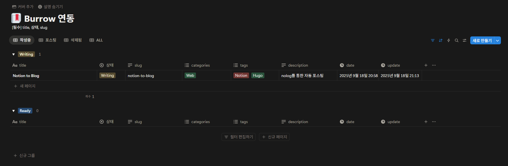

## 노션과 블로그의 연동

엊그제 Hugo와 Stack theme을 통해 Github Pages로 블로그를 만들었다. 하지만 노션에 적은 걸 다시 vscode를 켜고 마크다운 파일로 작성하고.. 태그로 이미지를 첨부하고.. 커밋하고 푸시해서 적용을 하는 과정은 너무나도 귀찮다! 글을 쓰는 게 귀찮으면 글 쓰기가 싫어진다!

그래서 [**nolog**](https://github.com/Sharknia/nolog)를 통해 노션과 블로그를 연동하기로 했다. 기본적인 적용 방법은 해당 repo의 README에 있으니 생략하고, 몇 가지 수정한 것만 기록용으로 적어본다.

## 노션 템플릿 수정


우선 템플릿을 현재 사용 중인 Hugo에 맞춰 속성을 추가/삭제했다.

- 나중에 블로그에서 작성일을 출력할 때 시간도 표시하고 싶은데, 날짜 유형은 시간을 표시하지 않아서 date 속성의 유형을 기존의 날짜에서 작성 시점으로 변경

- 문서를 저장할 때 `content/post/{slug}/index.md`로 저장해야 되기 때문에 slug 속성 추가

- 선택 유형인 series 속성을 categories로 변경하고 유형을 다중 선택으로 변경

## 페이지 URL 수정

```typescript
        // 페이지 URL을 생성합니다.
        const slugValue = page.properties['slug'] as string;
        page.pageUrl = `${subDirPath}${slugValue}`;
        page.pageIdx = page.properties['IDX'] as string;
```

pageUrl에서 slug를 사용할 수 있게 수정했다. 기존에는 pageTitle을 통해 pageUrl이 결정됐는데, slug를 추가했으니 기존 코드는 지웠다. 여기서 알아서 subDir을 생성해주니까 SAVE\_SUB\_DIR 변수는 추가하면 안된다.

## 데이터 추출 함수 수정

```typescript
case 'last_edited_time':
	result[key] = this.formatDateForBlog(property.last_edited_time);
	break;
case 'created_time':
	result[key] = this.formatDateForBlog(property.created_time);
	break;
```

기존에 생성되는 날짜 문자열의 포맷이 현재 사용 중인 포맷과 달라서 last\_edited\_time case를 수정해주고, 작성 시점을 frontmatter의 date로 사용할 거라 created\_time도 추가했다.

```typescript
    private formatDateForBlog(dateString: string): string {
        try {
            // ISO 8601을 한국 표준시(KST)로 변환
            const dt = new Date(dateString);
            const kstOffset = 9 * 60; // 한국은 UTC+9
            const kstTime = new Date(dt.getTime() + kstOffset * 60000);
            
            // 2025-09-17 07:00:00+0900 형식으로 포맷팅
            const year = kstTime.getUTCFullYear();
            const month = String(kstTime.getUTCMonth() + 1).padStart(2, '0');
            const day = String(kstTime.getUTCDate()).padStart(2, '0');
            const hours = String(kstTime.getUTCHours()).padStart(2, '0');
            const minutes = String(kstTime.getUTCMinutes()).padStart(2, '0');
            const seconds = String(kstTime.getUTCSeconds()).padStart(2, '0');
            
            return `${year}-${month}-${day} ${hours}:${minutes}:${seconds}+0900`;
        } catch (error) {
            console.error(`[page.ts] Date formatting error: ${error}`);
            return dateString; // 실패 시 원본 반환
        }
    }
```

파일의 아래 쪽에는 formatDateForBlog 함수를 작성했다. 기존의 `2025-09-18T05:26:00.000Z` 같은 ISOString 형식에서 `2025-09-17 07:00:00+0900` 형식으로 출력이 되게 변경했다.

## categories 다중 선택 처리

```typescript
    private formatMarkdownMetadata(): string {
        const metadata = ['---'];

        // 모든 properties 키에 대해 반복
        for (const key in this.properties) {
            const value = this.properties[key];

            // 값이 존재하고, 태그 혹은 카테고리 배열인 경우 특별 처리
            if (value) {
                if (key === 'tags' && Array.isArray(value)) {
                    metadata.push(`tags:\n  - ${value.join('\n  - ')}`);
                } else if (key === 'categories' && Array.isArray(value)) {
                    metadata.push(`categories:\n  - ${value.join('\n  - ')}`);
                } else {
                    // 기타 모든 속성에 대한 처리
                    metadata.push(`${key}: ${JSON.stringify(value)}`);
                }
            }
        }

        metadata.push('---', '');

        return metadata.join('\n');
    }
```

`categories`도 `tags`처럼 frontmatter에서 배열을 리스트로 변경해서 출력하도록 수정했다.

## 워크플로우 파일 수정

```yaml
on:
    workflow_dispatch:
    push:
    pull_request:
    schedule:
        - cron: '0 0 * * *'
```

원래 매 정각 cronjob을 하게 되어있었는데, 굳이 여러 번 할 필요는 없을 것 같아서 자정마다 되게 변경했고, 보통은 그냥 수동으로 누른다..

```yaml
- name: Commit and Push Changes to Current Repository
	run: |
		git config user.name '${{ vars.GIT_USER_NAME }}'
		git config user.email '${{ vars.GIT_USER_EMAIL }}'
		git pull origin master --rebase || git pull origin master --allow-unrelated-histories
		git add .
		git commit -m "Update metadata" || echo "No changes to commit in current repo"
		git remote set-url origin https://x-access-token:${{ secrets.GITHUB_TOKEN }}@github.com/${{ vars.GIT_USER_NAME }}/nolog.git
		git push origin HEAD:master
```

`git remote set-url origin` 부분의 마지막에 `notion-to-markdown.git`으로 되어있어서 repo명이 다르다. `nolog.git`으로 바꿔주면 정상적으로 작동한다.

## 결과

```markdown
---
IDX: "2"
slug: "image-test"
tags:
  - Notion
description: "이미지 테스트 용 포스트"
categories:
	- Web
update: "2025-09-18 17:35:00+0900"
date: "2025-09-18 14:22:00+0900"
상태: "Ready"
title: "이미지 테스트"
---


### 이미지 테스트

테스트테스트
```

frontmatter의 순서가 뒤죽박죽인 건 좀 불편하지만.. 어차피 이제 마크다운 파일을 직접 열진 않으니까 아무튼 좋았쓰!

지금 글을 쓰면서 확인해보니 노션의 h2 태그가 마크다운 변환 과정에서 h3로 변환되는 거 같은데, 아마 노션에서는 h1 태그를 그냥 쓰는 경우가 많아서 SEO 및 접근성 때문에 이렇게 하신 것 같다. 나는 노션에서도 h1 태그를 쓰지 않기 때문에.. 수정을 할 지 노션에서는 h1을 쓸 지 고민을 좀 해봐야겠다..

