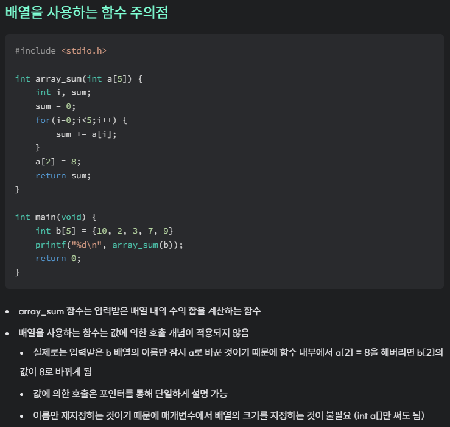

## 배열명

- C에서 일차원 배열은 메모리에 연속적으로 할당

- 배열명은 그 배열의 첫 번째 배열 요소를 가리키는 주소 값(&a[0])

- *a는 *(&a[0])이므로 a[0]의 값이 됨

- (포인터형) + 정수를 했을 때 실제 연산 결과는 (포인터형) + 정수\*(대상의크기) → a + i = &a[i]

- 포인터형끼리의 뺄셈은 두 주소 사이에 들어가는 변수의 개수

## 포인터와 1차원 배열

```c++
int a[5], *b, i;
int sum1=0, sum2=0, sum3=0, sum4=0;
...
b = a;
for(i=0; i<5; i++) {
    sum1 += a[i];
    sum2 += *(a+i);
    sum3 += *(b+i);
    sum4 += b[i];
}
```

- a와 b가 동일한 것은 아님

- b는 배열이 아니지만 배열처럼 사용할 수 있음

- 위에서 sum1~4를 출력할 경우 결과는 모두 같음

- **배열명**: 기호, 값을 바꿀 수 없음

- **포인터**: 변수, 값을 바꿀 수 있음

- 위 코드에서 'a = a+1'은 불가능하지만 'b = b+1'은 가능

### 포인터를 이용한 배열의 합 구하기

```c++
int a[5], *b, i;
int sum=0;
...
b = a;
for (i=0; i<5; i++) {
    sum += *b++;
}
```

### 배열 매개 변수


- ↑ [C 함수](https://www.notion.so/2735927db75a80eba2f7c21ad8a13751) 에서 작성했던 배열 매개 변수에 대한 해석

- 실제로는 여전히 값에 의한 호출임

- 배열 첫 번째 요소의 주소가 복사

## 포인터와 다차원 배열

```c++
int a[2][3];
int (*b)[3];
b = a;
```

- b를 2차원 배열인 것처럼 사용할 수 있음

- 뒤의 크기를 반드시 맞춰야 함

- 자료형 배열명[size1][size2]...[sizen] → 자료형 (*변수명)[size2]...[sizen]

