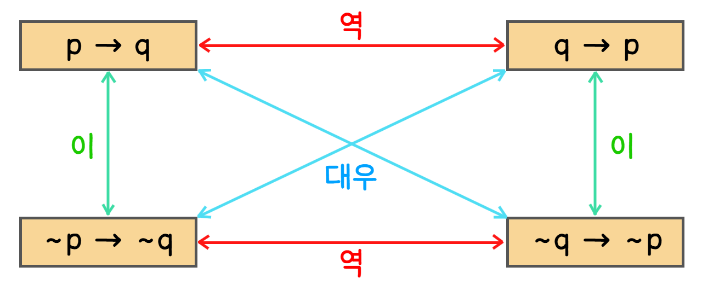

## 명제

- **명제**: 객관적인 기준으로 참/거짓을 구분할 수 있는 문장이나 수식

- **논증**: 전제와 결론으로 이루어져 어떤 주장이 옳다는 것을 보이기 위한 명제들의 나열

    - 결론: 논증의 마지막

    - 전제: 그 앞의 명제들

- **진릿값**: 참이나 거짓을 가리키는 값

- **합성명제**: 하나 이상의 명제가 결합되는 것, **부정**·**논리곱**·**논리합**·**배타적 논리합**과 같은 논리연산자를 이용

### 논리연산자

- 부정(**NOT**): **~p** 또는 **¬p**

- 논리곱(**AND**): **p∧q**, 두 명제가 모두 참(1)일 때만 참

- 논리합(**OR**): **p∨q**, 두 명제 중 하나라도 참이라면 참

- 배타적 논리합(**XOR**): **p⊻q** 또는 **p⊕q**, 두 명제 중 하나만 참일 때만 참

### 합성명제

- 우선순위: ① **()**, ② **¬**, ③ **∧**, ④ **∨**

- 항진명제: 합성명제를 구성하는 단일명제들의 진리값에 관계없이 항상 참인 합성명제

- 모순명제: 합성명제를 구성하는 단일명제들의 진리값에 관계없이 항상 거짓인 합성명제

- 사건명제: 항진명제도 모순명제도 아닌 합성명제

### 조건명제

- 문장 p, q가 명제일 때, p가 가정 또는 전제이고, q가 결론 또는 결과가 되는 명제 (p → q)

- p가 참이고 q가 거짓일 때만 거짓 = ~p∨q와 **논리적 동치**

### 쌍방조건명제

- **p ↔ q = (p → q) ∧ (q → p)**

- 문장 p, q가 명제일 때, p와 q가 가정이면서 동시에 결론인 명제

- p, q가 모두 참이거나 거짓일 때만 참

### 역, 이, 대우

| **p** | **q** | **조건명제** | **역** | **이** | **대우** |
| --- | --- | --- | --- | --- | --- |
|  |  | **p → q** | **q → p** | **~p → ~q** | **~q → ~p** |
| T | T | T | T | T | T |
| T | F | F | T | T | F |
| F | T | T | F | F | T |
| F | F | T | T | T | T |

- 원 명제가 참이면 그 대우 명제도 반드시 참이다.

### 논리적 동치

- **P = Q**

- 두 개의 합성명제 P와 Q의 진릿값이 서로 같은 경우

| **논리적 등치** |  | **법칙** |
| --- | --- | --- |
| p∧T ≡ p | p∨F ≡ p | 항등법칙 |
| p∧F ≡ F | p∨T ≡ T | 지배법칙 |
| p∧¬p ≡ F | p∨¬p ≡ T | 부정법칙 |
| ¬(¬p) ≡ p |  | 이중부정법칙 |
| p∧p ≡ p | p∨p ≡ p | 멱등법칙 |
| p∧q ≡ q∧p | p∨q ≡ q∨p | 교환법칙 |
| (p∧q)∧r ≡ p∧(q∧r) | (p∨q)∨r ≡ p∨(q∨r) | 결합법칙 |
| p∨(q∧r) ≡ (p∨q)∧(q∨r) | p∧(q∨r) ≡ (p∧q)∨(q∧r) | 분배법칙 |
| ¬(p∧q) ≡ ¬p∨¬q | ¬(p∨q) ≡ ¬p∧¬q | 드모르간의 법칙 |
| p∧(p∨q) ≡ p | p∨(p∧q) ≡ p | 흡수법칙 |
| p → q ≡ ¬p∨q |  | 함축법칙 |

## 명제함수

- **P(x)**

- 논의영역이 주어진 변수 x를 포함하여 진릿값을 판별할 수 있는 문장이나 수식

- **논의영역**(D): 명제함수에 포함된 변수 x의 범위나 값

### 전체한정자(전칭한정자) ∀

- **논의영역의 모든 값**

- 논의영역 D에 속하는 모든 x에 대한 명제, P(x) : ∀xP(x)

- 전체한정자로 범위가 정해진 명제함수는 논의영역에 포함되는 모든 원소에 대해 그 명제가 참이면 명제 함수도 참

- 논의영역에 포함되는 원소 중 하나라도 명제가 거짓이면 그 명제함수는 거짓

[object Promise]### 존재한정자 ∃

- **논의영역 중 어떤 값**

- 논의영역 D에 속하는 원소 중 어떤 x에 대한 명제, P(x) : ∃xP(x)

[object Promise]### 한정자와 부정연산자

- 명제함수도 명제이기 때문에 논리연산이 가능

- 한정자와 AND, OR에 대한 정리

    - ∀x(P(x)∧Q(x)) ≡ ∀xP(x)∧∀xQ(x)

    - ∃x(P(x)∨Q(x)) ≡ ∃xP(x)∨∃xQ(x)

- 한정자와 NOT에 대한 정리

    - ¬(∀x(P(x)) ≡ ∃x(¬P(x))

    - ¬(∃x(P(x)) ≡ ∀x(¬P(x))

## 추론(논증)

- 참인 명제를 근거로 하여 다른 명제가 참임을 유도하는 방식

- **전제(가정)**: 결론의 근거가 되는 최종 결론을 제외한 명제, 진릿값이 참으로 간주되는 명제

- **결론**: 주어진 전제에 의해 유도된 명제

- **유효추론**: 주어진 전제를 이용해 유도된 결론이 정확한 추론 = 전제가 참일 때 결론이 모두 참인 추론

- **허위추론**: 주어진 전제를 이용해 유도된 결론이 틀린 추론 = 전제가 참인 경우 결론이 거짓인 경우가 하나라도 있는 추론

