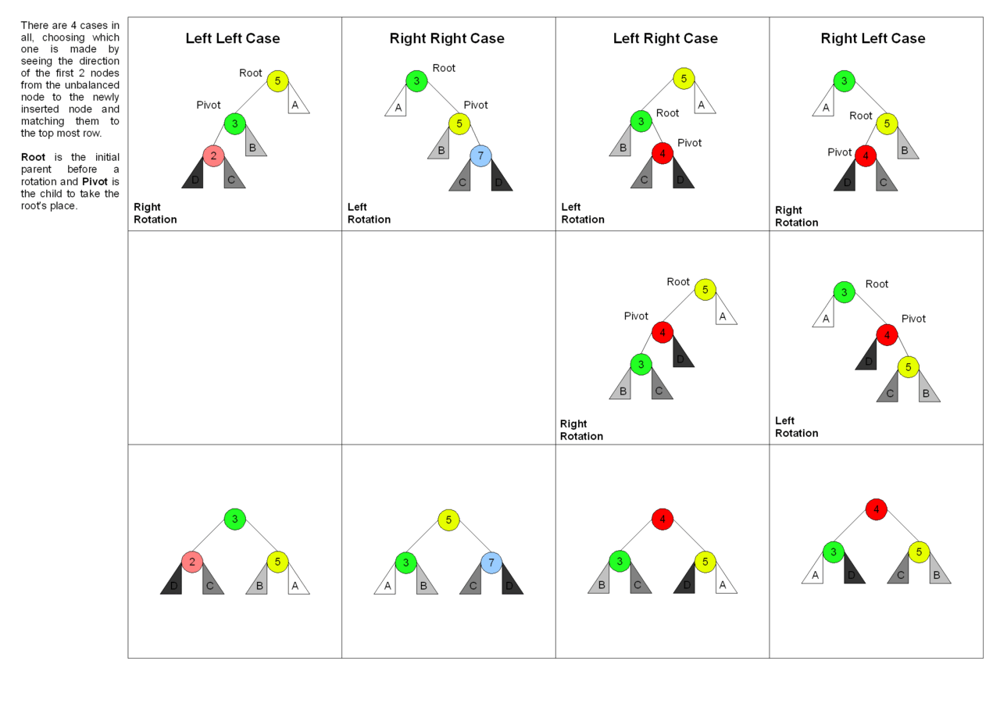

## 이진탐색트리

- 효율적인 탐색을 위한 이진트리 기반의 자료구조

- 삽입, 삭제, 탐색: O(log n)

- 모든 노드는 유일한 키를 가짐

    - 왼쪽 서브트리의 키들은 루트의 키보다 작음

    - 오른쪽 서브트리의 키들은 루트의 키보다 큼

    - 왼쪽과 오른쪽 서브트리도 이진 탐색트리

### 이진탐색트리의 연산

#### 노드의 구조

- 탐색키, 키에 대한 값의 형태

```python
class BSTNode:
    def __init__(self, key, value):
        self.key = key
        self.value = value
        self.left = None
        self.right = None
```

#### 탐색 연산

- 키를 이용한 탐색

    - 루트를 기준으로 작으면 왼쪽 자식부터, 크면 오른쪽 자식부터 다시 탐색

    - 과정을 반복하며 탐색키와 동일한 키를 찾을 경우 탐색 성공, 못 찾으면 탐색 실패

- 순환 구조와 반복 구조로 구현할 수 있음

```python
# 이진트리탐색 탐색연산 (순환 함수)
def search_bst(n, key):
    if n == None:
        return None
    elif key == n.key:
        return n
    elif key < n.key:
        return search_bst(n.left, key)
    else:
        return search_bs(n.right, key)

# 이진트리탐색 탐색연산 (반복 함수)
def search_bst_iter(n, key):
    while n != None:
        if key == n.key:
            return n
        elif key < n.key:
            n = n.left
        else:
            n = n.right
    return None
```

- 값을 이용한 탐색일 경우 모든 노드를 검사해야 함

- 최대/최소 값의 노드 탐색

```python
def search_max_bst(n):
    while n != None and n.right != None:
        n = n.right
    return n

def search_min_bst(n):
    while n != None and n.left != None:
        n = n.left
    return n
```

#### 삽입 연산

- 탐색에 실패한 위치 = 노드를 삽입해야 하는 위치

```python
# 이진탐색트리 삽입연산 (노드 삽입): 순환구조 이용
def insert_bst(r, n):
    # 삽입할 노드의 키가 루트보다 작으면
    if n.key < r.key:
        # 루트의 왼쪽 자식이 없으면 n은 루트의 왼쪽 자식이 됨
        if r.left is None:
            r.left = n
            return True
        # 왼쪽 자식이 있으면 왼쪽 자식에게 삽입
        else:
            return insert_bst(r.left, n)
    # 삽입할 노드의 키가 루트보다 크면
    elif n.key > r.key:
        # 루트의 오른쪽 자식이 없으면 n은 루트의 오른쪽 자식이 됨
        if r.right is None:
            r.right = n
            return True
        # 오른쪽 자식이 있으면 오른쪽 자식에게 삽입
        else:
            return insert_bst(r.right, n)
    # 키가 중복되면 삽입하지 않음
    else:
        retrun false
```

#### 삭제 연산

- 삭제하려는 노드가 단말 노드일 경우

```python
def delete_bst_case1(parent, node, root):
    if parent is None:
        root = None
    else:
        if parent.left == node:
            parent.left = None
        else:
            parent.right = None
    # root가 변경될 수도 있으므로 반환
    return root
```

- 삭제하려는 노드가 하나의 왼쪽이나 오른쪽 서브 트리 중 하나만 가지고 있는 경우

```python
def delete_bst_case2(parent, node, root):
    if node.left is not None:
        child = node.left
    else:
        child = node.right
    if node == root:
        root = child
    else:
        if node is parent.left:
            parent.left = child
        else:
            parent.right = child
    return root
```

- 삭제하려는 노드가 두 개의 서브 트리를 모두 가지고 있는 경우

    - 가장 비슷한 값을 가진 노드를 삭제 위치로 가져옴

        - 삭제할 위치에 왼쪽 서브트리의 가장 큰 노드나 오른쪽 서브트리의 가장 작은 노드가 들어가면 이진탐색트리의 조건을 계속 만족함

    - 후계 노드의 선택

```python
def delete_bst_case3(parent, node, root):
    succp = node
    succ = node.right
    while (succ.left != None):
        succp = succ
        succ = succ.left

    if (succp.left == succ): succp.left = succ.right
    else: succp.right = succ.right
    node.key - succ.key
    node.value = succ.value
    node = succ

    return root
```

- 삭제 연산 전체 코드

```python
def delete_bst(root, key):
    if root == None: return None

    parent = None
    node = root
    while node != None and node.key != key:
        parent = node
        if key < node.key: node = node.left
        else: node = node.right

    if node == None: return None	# 삭제할 노드가 없으면 None
    if node.left == None and node.right == None:
        root = delete_bst_case1(parent, node, root)
    elif node.left == None or node.right == None:
        root = delete_bst_case2(parent, node, root)
    else:
        root = delete_bst_case3(parent, node, root)
    return root
```

### 이진탐색트리의 성능

- 탐색, 삽입, 삭제 연산의 시간 트리의 높이에 비례

| **연산** | **함수** | **최선의 경우 (균형)** | **최악의 경우 (경사)** |
| --- | --- | --- | --- |
| **키를 이용한 탐색** | search_bst()
search_bst_iter() | O(log₂n) | O(n) |
| **값을 이용한 탐색** | search_value_bst() | O(n) | O(n) |
| **최대/최소 노드 탐색** | search_max_bst()
search_min_bst() | O(log₂n) | O(n) |
| **삽입** | insert_bst() | O(log₂n) | O(n) |
| **삭제** | delete_bst() | O(log₂n) | O(n) |

## AVL 트리

- 모든 노드에서 왼쪽 서브트리와 오른쪽 서브트리의 높이 차가 1을 넘지 않는 이진탐색

    - 모든 노드의 균형 인수는 0이나 ±1이 되어야 함

    - 균형 인수: 왼쪽 서브트리 높이 - 오른쪽 서브트리 높이

- 평균, 최선, 최악 시간 복잡도: O(log n) 보장

### AVL 트리의 연산

- 탐색 연산은 이진탐색트리와 동일

- 삽입과 삭제 시 균형 상태가 깨질 수 있음

#### 삽입 연산

- 삽입 위치에서 루트까지의 경로에 있는 조상 노드들의 균형 인수에 영향을 미침

- 삽입 후에 불균형 상태로 변한 가장 가까운 조상 노드(균형 인수가 ±2가 된 가장 가까운 조상 노드)의 서브 트리들에 대하여 다시 재균형

- 삽입 노드부터 균형 인수가 ±2가 된 가장 가까운 조상 노드까지 회전


- 균형이 깨지는 4가지 경우: LL, LR, RR, RL 타입

    - 새로 삽입된 노드 N으로부터 가장 가까우면서 균형인수가 ±2가 된 조상 노드를 A라고 할 때


- 단순 회전

    - LL 타입

        - 불균형 노드의 왼쪽 서브트리의 왼쪽 서브트리의 높이 증가

        - N이 A의 왼쪽 자식의 왼쪽 서브 트리에 삽입됨

    - LR 타입

        - 불균형 노드의 왼쪽 서브트리의 오른쪽 서브트리의 높이 증가

        - N이 A의 왼쪽 자식의 오른쪽 서브 트리에 삽입됨

- 이중 회전

    - RR 타입

        - 불균형 노드의 오른쪽 서브트리의 왼쪽 서브트리의 높이 증가

        - N이 A의 오른쪽 자식의 오른쪽 서브 트리에 삽입됨

    - RL 타입

        - 불균형 노드의 오른쪽 서브트리의 오른쪽 서브트리의 높이 증가

        - N이 A의 오른쪽 자식의 왼쪽 서브 트리에 삽입됨

- 탐색 순서를 유지하면서 부모와 자식의 위치를 교환

```python
# LL 회전
def rotateLL(A):
    B = A.left
    A.left = B.right
    B.right = A
    # 새로운 루트 B를 반환
    return B
```

```python
# RR 회전
def rotateRR(A):
    B = A.right
    A.right = B.left
    B.left = A
    return B
```

```python
# RL 회전
def rotateRL(A):
    B = A.right
    A.right = rotateLL(B)
    return rotateRR(A)
```

```python
# LR 회전
def rotateLR(A):
    B = A.left
    A.left = rotateRR(B)
    return rotateLL(A)
```

#### 재균형 함수

```python
def reBalance(parent):
    hDiff = calc_height_diff(parent)

    if hDiff > 1:
        if calc_height_diff(parent.left) > 0:
            parent = rotateLL(parent)
        else:
            parent = rotateLR(parent)
    elif hDiff < -1:
        if calc_height_diff(parent.right) < 0:
            parent = rotateRR(parent)
        else:
            parent = rotateRL(parent)
    return parent
```

#### AVL 트리의 삽입 함수

```python
def insert_avl(parent, node):
    if node.key < parent.key:
        if parent.left != None:
            parent.left = insert_avl(parent.left, node)
        else:
            parent.left = node
        return reBalance(parent)
    elif node.key > parent.key:
        if parent.right != None:
            parent.right = insert_avl(parent.right, node)
        else:
            parent.right = node
        return reBalance(parent)
    else:
        print("중복된 키 에러")
```

### AVL 트리의 균형

- 장점: 탐색 효율 O(log n)을 보장해줌

- 단점: 삽입/삭제 될 때마다 균형 파괴 여부 검사(균형 인수 값을 구하는 시간) 필요, 트리를 재구성하는 시간 필요

- 균형 트리

    - Balanced Tree

    - 탐색 효율 O(log n)을 보장

    - 루트로부터 리프까지 가는 경로를 최소화

- 자체 조정 트리

    - 무조건 균형보다는 자주 탐색되는 노드는 또 탐색될 확률이 높으므로 루트 근처에 위치시킴

#### 자체 조정 트리를 만드는 방법

- 조정 방법 ①: 어떤 노드가 탐색될 때마다 그 노드를 바로 위 부모 노드로 올리는 방법 (한 번의 회전)

- 조정 방법 ②:어떤 노드가 탐색될 때마다 전체 트리의 루트로 올리는 방법 (연속된 회전 필요)

- 문제점: 조정 방법 ②의 한계로 트리의 균형 면에서 불리함

#### 스플레이 기법

- 스플레이(Splay): 조정 방법 ②를 개선하여 탐색된 노드를 루트로 올리되, 한 번에 두 레벨 씩 위로 올림

- 자체 조정 트리에서 어떤 노드가 탐색되면 그 노드를 아예 전체 트리의 루트로 올리는 방법

- 지그재그 LL/RR: 올리고자 하는 노드가 그보다 두 레벨 위의 노드로부터 LR/RL 경로로 따라 내려올 때

    - AVL의 LR/RL 회전과 완전히 동일

## References

- [Tree rotation](https://en.wikipedia.org/wiki/Tree_rotation)

