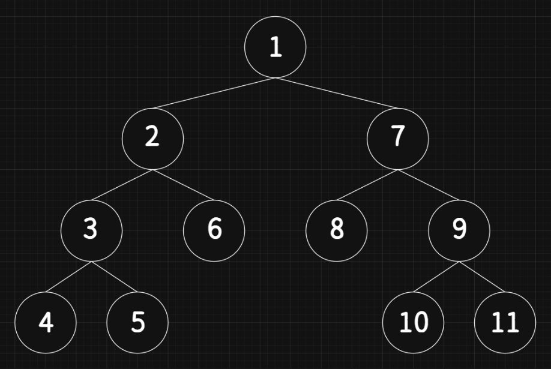
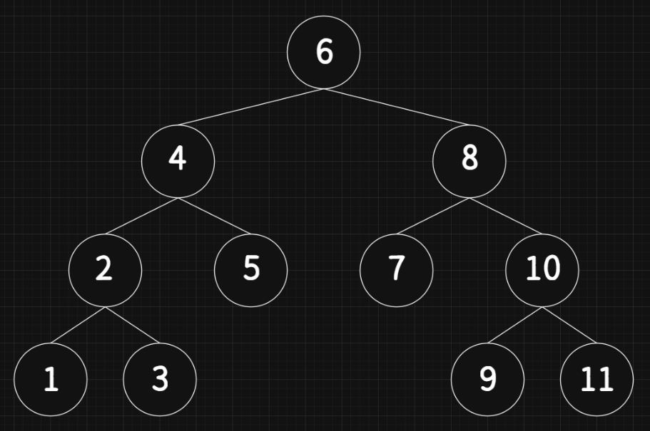
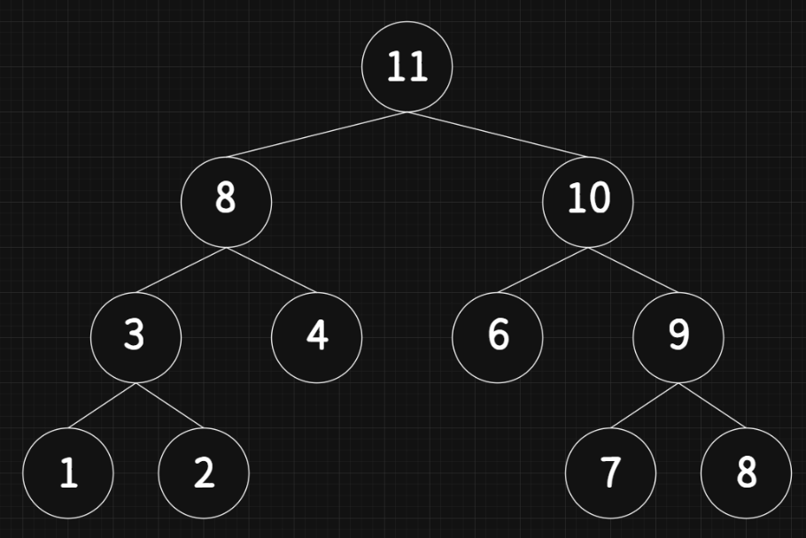
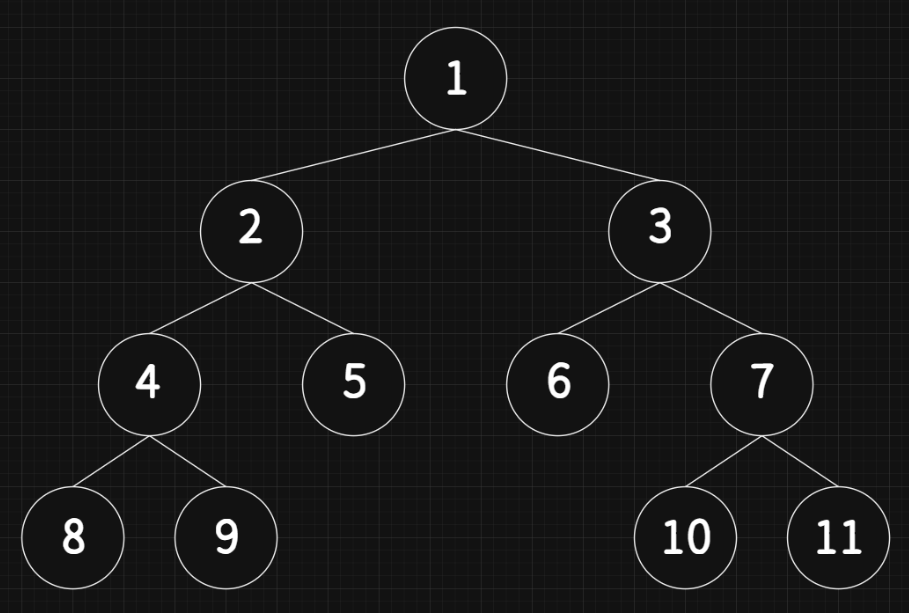

## 트리

- 계층적인 자료의 표현에 적합한 자료 구조

- 트리의 모든 노드는 자신의 서브트리의 루트 노드

- 연결된 위 레벨의 노드는 부모 노드, 아래 레벨의 노드는 자식 노드

- **단말 노드**: 자손이 없는 노드, 자손이 있으면 비단말 노드

- **차수**: 해당 노드의 자식 노드의 수

- **트리의 차수**: 트리를 구성하고 있는 각 노드의 차수 중 가장 높은 차수

## 이진트리

- **모든 노드가 2개의 서브 트리를 갖는 트리**

- 공집합이거나 루트와 왼쪽/오른쪽 서브 트리로 구성된 노드들의 집합

- 순환적으로 정의됨

- 서브트리는 공집합일 수 있음

- 이진트리의 서브 트리들은 모두 이진트리이어야 함

### 이진트리의 분류

- 포화 이진트리 (Full Binary Tree)

    - 트리의 각 레벨에 노드가 꽉 차 있는 이진트리

- 완전 이진트리 (Complete Binary Tree)

    - 높이가 h일 때 레벨 1부터 h-1까지는 노드가 모두 채워짐

    - 마지막 레벨 h에서는 노드가 순서대로 채워짐

- 경사 이진트리

    - 왼쪽으로만 자식 노드가 일렬로 늘어 놓인 이진트리

### 이진트리의 성질

- 노드의 개수가 n개이면 간선의 개수는 n-1 (루트 노드는 부모가 없음)

- 높이가 h이면 h ~ 2ʰ-1개의 노드를 가짐 (각 레벨에 최소 하나의 노드가 있어야 함)

- n개 노드의 이진트리 높이 = \[log₂ (n+1)\] ~ n

### 이진트리의 표현

- **배열 표현법**: 높이가 K일 때 필요한 배열의 길이 = 2ᵏ-1

    - 높이 i의 부모 노드 인덱스 = i//2 (정수 나눗셈)

    - 노드 i의 왼쪽 자식 노드 인덱스 = 2i

    - 노드 i의 오른쪽 자식 노드 인덱스 wi+1

- **링크 표현법**: 데이터의 왼쪽과 오른쪽에 각각 자식노드의 링크

    - 링크 2개만 있으면 표현이 가능함

    - 경사 이진트리에서 화살표가 없는 링크는 None을 가짐

```python
class Tnode:
    def __init__(self, data, left, right):
        self.data = data
        self.left = left
        self.right = right
```

## 순회

- Traversal

- 트리에 속하는 모든 노드를 한 번씩 방문하는 것

- 선형 자료구조는 순회가 단순

- 트리는 다양한 방법이 있음

- 이진트리의 기본 순회 (루트 노드가 `V`, 왼쪽 서브트리가 `L`, 오른쪽 서브트리가 `R`)

    - **전위 순회**(Preorder Traversal): `VLR`

    - **중위 순회**(Inorder Traversal): `LVR`

    - **후위 순회**(Postorder Traversal): `LRV`

### 전위 순회

- Preorder Traversal

- 루트 → 왼쪽 서브트리 → 오른쪽 서브트리

- 응용 예: 노드의 레벨 계산, 구조화된 문서 출력

```python
def preorder(n):
    if n is not None:
        print(n.data, end='')
        preorder(n.left)
        preorder(n.right)
```


### 중위 순회

- Inorder Traversal

- 왼쪽 서브트리 → 루트 → 오른쪽 서브트리

- 응용 예: 정렬

```python
def inorder(n):
    if n is not None:
        preorder(n.left)
        print(n.data, end='')
        preorder(n.right)
```


### 후위 순회

- Postorder Traversal

- 왼쪽 서브트리 → 오른쪽 서브트리 → 루트

- 응용 예: 폴더 용량 계산

```python
def postorder(n):
    if n is not None:
        preorder(n.left)
        preorder(n.right)
        print(n.data, end='')
```


### 레벨 순회

- 노드를 레벨 순으로 검사하는 순회 방법

- 큐를 사용해 구현

- 순환을 사용하지 않음

```python
def levelorder(root):
    queue = CircularQueue()
    queue.enqueue(root)
    while not queue.isEmpty():
        n = queue.dequeue()
        if n is not None:
            print(n.data, end='')
            queue.enqueue(n.left)
            queue.enqueue(n.right)
```


### 이진트리 연산

#### 노드 개수

```python
def count_node(n):	# 순환을 이용해 트리의 노드 수를 계산하는 함수
    if n is None:	# n이 None이면 공백 트리 → 0을 반환
        return 0
    else:		# 좌우 서브트리의 노드수의 합+1을 반환 (순환이용)
        return 1 + count_node(n.left) + count_node(n.right)
```

#### 단말 노드의 수

```python
def count_leaf(n):
    if n is None:	# 공백 트리 → 0을 반환
        return 0
    elif n.left is None and n.right is None:	# 단말 노드 → 1을 반환
        return 1
    else:		# 비단말 노드 → 좌우 서브트리의 결과 합을 반환
        return count_leaf(n.left) + count_leaf(n.right)
```

#### 트리 높이

```python
def calc_height(n):
    if n is None:			# 공백 트리 → 0을 반환
        return 0
    hLeft = calc_height(n.left)		# 왼쪽 트리의 높이
    hRight = calc_height(n.right)	# 오른쪽 트리의 높이
    if (hLeft > hRight):		# 더 높은 높이에 1을 더해 반환
        return hLeft + 1
    else:
        return hRight + 1
```

### 테스트 프로그램

```python
import queue

class CircularQueue:
    def __init__(self):
        self.q = queue.Queue(maxsize=10)
        self.front = 0
        self.rear = 0
    def isEmpty(self):
        return self.q.empty()
    def isFull(self):
        return self.q.full()
    def clear(self):
        self.q = queue.Queue(maxsize=10)
        self.front = 0
        self.rear = 0
    def enqueue(self, item):
        if not self.isFull():
            self.q.put(item)
            self.rear = (self.rear + 1) % 10
    def dequeue(self):
        if not self.isEmpty():
            item = self.q.get()
            self.front = (self.front + 1) % 10
            return item
    def peek(self):
        if not self.isEmpty():
            return list(self.q.queue)[0]
    def size(self):
        return self.q.qsize()
    def display(self):
        items = list(self.q.queue)
        print(f'[f={self.front}, r={self.rear}] ==> ', items)

class Tnode:
    def __init__(self, data, left, right):
        self.data = data
        self.left = left
        self.right = right

def preorder(n):
    if n is not None:
        print(n.data, end='')
        preorder(n.left)
        preorder(n.right)

def inorder(n):
    if n is not None:
        preorder(n.left)
        print(n.data, end='')
        preorder(n.right)

def postorder(n):
    if n is not None:
        preorder(n.left)
        preorder(n.right)
        print(n.data, end='')

def levelorder(root):
    queue = CircularQueue()
    queue.enqueue(root)
    while not queue.isEmpty():
        n = queue.dequeue()
        if n is not None:
            print(n.data, end='')
            queue.enqueue(n.left)
            queue.enqueue(n.right)

def count_node(n):
    if n is None:
        return 0
    else:
        return 1 + count_node(n.left) + count_node(n.right)

def count_leaf(n):
    if n is None:
        return 0
    elif n.left is None and n.right is None:
        return 1
    else:
        return count_leaf(n.left) + count_leaf(n.right)

def calc_height(n):
    if n is None:
        return 0
    hLeft = calc_height(n.left)
    hRight = calc_height(n.right)
    if (hLeft > hRight):
        return hLeft + 1
    else:
        return hRight + 1

d = Tnode('D', None, None)
e = Tnode('E', None, None)
b = Tnode('B', d, e)
f = Tnode('F', None, None)
c = Tnode('C', f, None)
root = Tnode('A', b, c)

print('\\n In-Order: ', end='')
inorder(root)
print('\\n Pre-Order: ', end='')
preorder(root)
print('\\n Post-Order: ', end='')
postorder(root)
print('\\n Level-Order: ', end='')
levelorder(root)

print("\\n노드의 개수 = %d개" % count_node(root))
print("단말의 개수 = %d개" % count_leaf(root))
print("트리의 높이 = %d" % calc_height(root))
```

```bash
 In-Order: BDEACF
 Pre-Order: ABDECF
 Post-Order: BDECFA
 Level-Order: ABCDEF
노드의 개수 = 6개
단말의 개수 = 3개
트리의 높이 = 3
```

