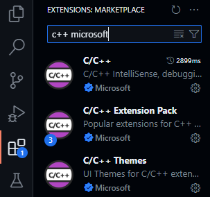
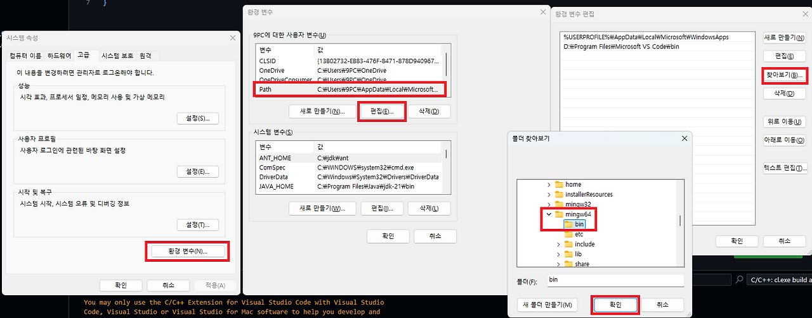

## VS Code C++ extension 설치


- 3개 다 설치

## MinGW-w64 toolchain 설치



- MSYS2 웹사이트에서 설치 프로그램을 다운로드

- 설치 후 MSYS2 터미널에서 아래 명령어로 MinGW-w64 toolchain 설치

```bash
pacman -S --needed base-devel mingw-w64-ucrt-x86_64-toolchain
```

- Windows 환경 변수 PATH에 MinGW-w64의 bin 폴더 경로 추가


## tasks.json

```json
{
    "version": "2.0.0",
    "tasks": [
        {
            "type": "cppbuild",
            "label": "C/C++: g++.exe build active file",
            "command": "C:\\\\msys64\\\\mingw64\\\\bin\\\\g++.exe",
            "args": [
                "-fdiagnostics-color=always",
                "-g",
                "${file}",
                "-o",
                "${workspaceFolder}\\\\${fileBasenameNoExtension}.exe"
            ],
            "options": {
                "cwd": "${fileDirname}"
            },
            "problemMatcher": ["$gcc"],
            "group": {
                "kind": "build",
                "isDefault": true
            },
            "detail": "Task generated by Debugger."
        }
    ]
}
```

## launch.json

```json
{
    "version": "0.2.0",
    "configurations": [
        {
            "name": "(gdb) Launch",
            "type": "cppdbg",
            "request": "launch",
            "program": "${workspaceFolder}/${fileBasenameNoExtension}.exe",
            "args": [],
            "stopAtEntry": false,
            "cwd": "${fileDirname}",
            "environment": [],
            "externalConsole": false,
            "MIMode": "gdb",
            "miDebuggerPath": "C:\\\\msys64\\\\mingw64\\\\bin\\\\gdb.exe",
            "setupCommands": [
                {
                    "description": "Enable pretty-printing for gdb",
                    "text": "-enable-pretty-printing",
                    "ignoreFailures": true
                }
            ]
        }
    ]
}
```

