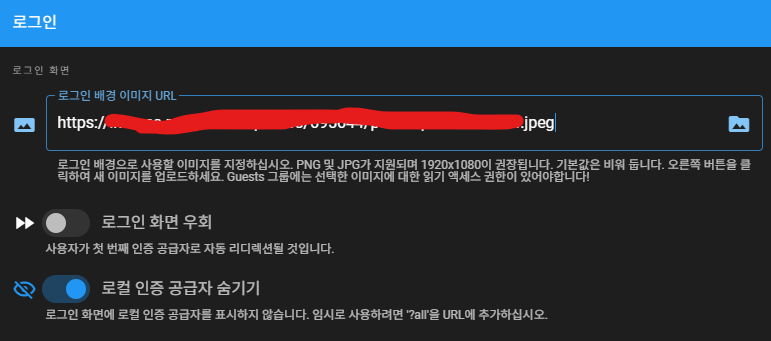

## 설치

```bash
# Fetch latest updates
sudo apt -qqy update

# Install all updates automatically
sudo DEBIAN_FRONTEND=noninteractive apt-get -qqy -o Dpkg::Options::='--force-confdef' -o Dpkg::Options::='--force-confold' dist-upgrade

# Install dependencies to install Docker
sudo apt -qqy -o Dpkg::Options::='--force-confdef' -o Dpkg::Options::='--force-confold' install ca-certificates curl gnupg lsb-release

# Register Docker package registry
sudo mkdir -p /etc/apt/keyrings
curl -fsSL <https://download.docker.com/linux/ubuntu/gpg> | sudo gpg --dearmor -o /etc/apt/keyrings/docker.gpg
echo "deb [arch=$(dpkg --print-architecture) signed-by=/etc/apt/keyrings/docker.gpg] <https://download.docker.com/linux/ubuntu> $(lsb_release -cs) stable" | sudo tee /etc/apt/sources.list.d/docker.list > /dev/null

# Refresh package udpates and install Docker
sudo apt -qqy update
sudo apt -qqy -o Dpkg::Options::='--force-confdef' -o Dpkg::Options::='--force-confold' install docker-ce docker-ce-cli containerd.io docker-compose-plugin

# Create installation directory for Wiki.js
sudo mkdir -p /etc/wiki
# 이건 내가 쓰려고 추가, 이거 안 할 거면 아래 openssl도 sudo 써야 될? 듯?
sudo chown ubuntu:ubuntu /etc/wiki

# Generate DB secret
openssl rand -base64 32 > /etc/wiki/.db-secret

# Create internal docker network
sudo docker network create wikinet

# Create data volume for PostgreSQL
sudo docker volume create pgdata

# Create the containers
sudo docker create --name=db -e POSTGRES_DB=wiki -e POSTGRES_USER=wiki -e POSTGRES_PASSWORD_FILE=/etc/wiki/.db-secret -v /etc/wiki/.db-secret:/etc/wiki/.db-secret:ro -v pgdata:/var/lib/postgresql/data --restart=unless-stopped -h db --network=wikinet postgres:17
sudo docker create --name=wiki -e DB_TYPE=postgres -e DB_HOST=db -e DB_PORT=5432 -e DB_PASS_FILE=/etc/wiki/.db-secret -v /etc/wiki/.db-secret:/etc/wiki/.db-secret:ro -e DB_USER=wiki -e DB_NAME=wiki -e UPGRADE_COMPANION=1 --restart=unless-stopped -h wiki --network=wikinet -p 80:3000 -p 443:3443 ghcr.io/requarks/wiki:2
sudo docker create --name=wiki-update-companion -v /var/run/docker.sock:/var/run/docker.sock:ro --restart=unless-stopped -h wiki-update-companion --network=wikinet ghcr.io/requarks/wiki-update-companion:latest
```

- 포트 변경 시 `docker create --name=wiki` 부분에서 `80:3000`과 `443:3443`에서 80, 443 변경 후 nginx로 돌려주면 됨

- 5432, 3000, 3443은 서버 내에서만 사용돼서 따로 설정할 필요 없음

- 오라클 클라우드 기준이면 상관 없는데 방화벽 설정 필요할 경우 ↓

```bash
sudo ufw allow ssh
sudo ufw allow http
sudo ufw allow https

sudo ufw --force enable
```

## 실행

```bash
sudo docker start db
sudo docker start wiki
sudo docker start wiki-update-companion
```

- 실행 후 Let's Encrypt 인증 전 사이트 설정을 먼저 할 것

- 사이트 설정 시 문서 생성하기 전에 언어 설정부터 변경

## Let's Encrypt

```bash
sudo docker stop wiki
sudo docker rm wiki

sudo docker create --name=wiki -e LETSENCRYPT_DOMAIN=wiki.example.com -e LETSENCRYPT_EMAIL=admin@example.com -e SSL_ACTIVE=1 -e DB_TYPE=postgres -e DB_HOST=db -e DB_PORT=5432 -e DB_PASS_FILE=/etc/wiki/.db-secret -v /etc/wiki/.db-secret:/etc/wiki/.db-secret:ro -e DB_USER=wiki -e DB_NAME=wiki -e UPGRADE_COMPANION=1 --restart=unless-stopped -h wiki --network=wikinet -p 80:3000 -p 443:3443 ghcr.io/requarks/wiki:2

sudo docker start wiki
sudo docker logs wiki
```

- restart 할 때마다 자동 갱신

    - `sudo docker restart wiki`

## Discord Auth

- [**Discord Developer Portal**](https://discord.com/developers/applications) > 어플리케이션 생성 > OAuth2

    - Client ID, Client Secret 복사

- wiki.js 관리 페이지 > 계정 인증 > 전략 추가 > 디스코드 선택

    - 복사한 Client ID, Client Secret 붙여넣기

    - (선택) Server ID에 디스코드 서버의 ID를 입력하면 해당 서버의 멤버만 가입 가능

        - 서버 ID 입력 시 redirect가 정상적으로 되지 않을 경우 wiki.js restart

    - 아래 쪽의 **콜백 혹은 리다이렉트 URL** 복사해서 Discord Developer Portal OAuth 페이지의 Redirects에 추가

- 위 내용 모두 완료 후에 적용, 정상적으로 진행되는지 확인 후 관리 페이지 > 보안 > 로컬 인증 공급자 숨기기 활성화

    - 로그인 화면에서 디스코드만 뜨지만 url 뒤에 ?all이 있을 경우 로컬 로그인도 가능

## 로그인 페이지 배경 이미지 변경


- 관리 페이지 > 보안 > 로그인 > 로그인 배경 이미지 URL

- ImgBB 같은 곳에 올리고 원본 이미지 링크 사용

## 사용 후기

node.js 기반이라 써봤는데 그냥 노션에 쓰고 말지 딱히 메리트가 있는 것 같지는 않다..

