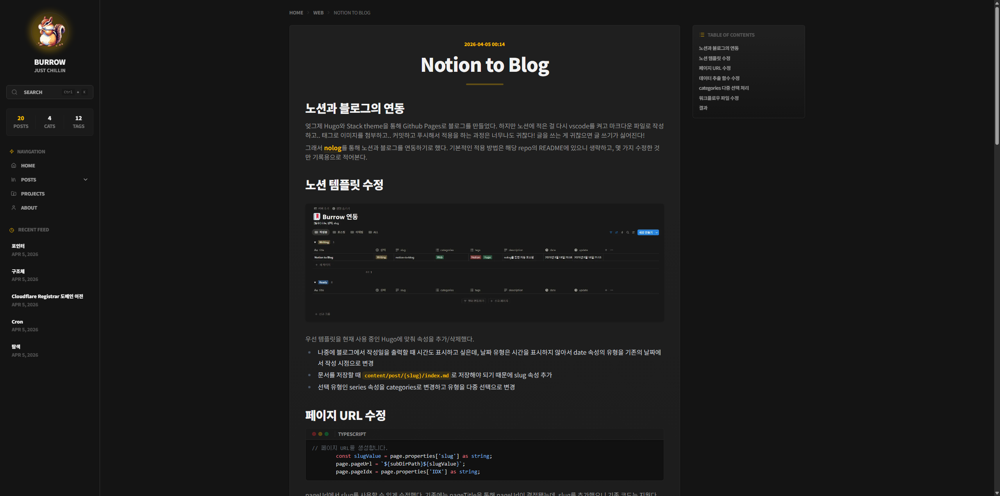
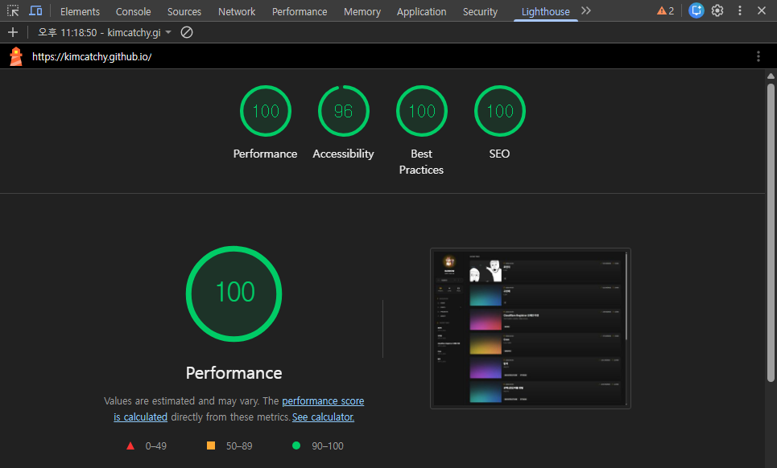

## 또 시작된 블로그 마이그레이션

이전 포스트에서 `nolog`라는 툴을 이용해 Notion과 Hugo 블로그를 연동하는 글을 썼었다. 한동안 잘 사용했지만, 시간이 지나면서 몇 가지 문제와 갈증이 생겼다.

첫 번째는 `nolog` 레포지토리의 업데이트가 중단되었다는 점이다. 안 그래도 기존 Hugo 블로그를 만들 때 버전 업데이트를 염두에 두지 않고 고쳐쓰다보니 Hugo 업데이트 과정에서도 문제가 생겼고, nolog도 다시 고쳐 쓸 엄두가 나지 않았다.

두 번째는 **나만의 테마를 처음부터 끝까지 내 손으로 만들고 싶다**는 욕심이었다. Hugo의 Stack 테마도 훌륭했지만, Go 템플릿(Go html/template) 문법은 익숙해지기 어려웠고, 원하는 UI/UX를 깊게 커스터마이징하는 데 한계가 있었다.

그래서 Hugo를 대체할 만한 정적 사이트 생성기(SSG)를 찾다가 **Astro**로 넘어가기로 결정했다.

## 왜 Hugo 대신 Astro인가?

Astro를 선택한 이유는 명확했다.

1. **Zero-JS by Default**: 기본적으로 자바스크립트를 배제하고 순수 HTML/CSS만 렌더링하기 때문에 Hugo만큼이나 빠르다. 정적 블로그에 이보다 좋은 특징은 없다.
2. **개발 경험**: Go 템플릿과 싸울 필요 없이, React와 매우 유사한 Astro 문법을 사용할 수 있다. 컴포넌트 기반 아키텍처라 코드를 분리하고 재사용하기 훨씬 편했다.
3. **최신 생태계 호환성**: Tailwind CSS v4와 shadcn/ui 같은 모던 UI 라이브러리를 붙이기가 너무 수월했다.
4. **Content Layer**: Astro의 Content Collections를 사용하면 마크다운의 Frontmatter를 TypeScript로 Strict type 검증을 할 수 있어서 안정성이 대폭 올라간다.

## 프로젝트 아키텍처

늘 사용하던 블로그 타이틀인 Burrow처럼, 다람쥐가 도토리를 모으듯이, 내가 알게된 새로운 지식들과 문제 해결 과정을 기록하는 목적의 블로그이다. 새로운 블로그 프로젝트는 단순하고, 빠르고, 정보에 집중할 수 있는 나만의 디지털 아카이브를 만드는 것이 목표였다.

프로젝트 구조는 크게 두 가지로 완전히 분리했다.

- [`kimcatchy/kimcatchy.github.io`](https://github.com/kimcatchy/kimcatchy.github.io): 블로그의 프론트엔드를 담당하는 실제 웹사이트 코드
- [`kimcatchy/notion-to-blog`](https://github.com/kimcatchy/notion-to-blog): 노션 API를 호출하고 데이터를 마크다운으로 변환하는 동기화 서비스

### 1. Custom Notion Sync 개발

가장 핵심적인 작업은 `nolog`를 버리고 **나만의 동기화 스크립트를 TypeScript로 직접 작성**하는 것이었다. `@notionhq/client`와 `notion-to-md`를 활용해 노션 데이터베이스에서 글을 긁어오도록 만들었다.

특히 가장 신경 쓴 부분은 **이미지 처리(Image Localization)** 였다. 노션 API에서 제공하는 이미지 URL은 일정 시간이 지나면 만료되는 문제가 있다. 그래서 스크립트가 실행될 때 노션 본문에 있는 모든 이미지를 다운로드하여 `astro/src/assets/notion/` 폴더에 로컬로 저장하고, 마크다운 내부의 이미지 경로를 상대 경로(`../../assets/...`)로 자동 변환하도록 구현했다.

데이터베이스 속성도 Astro의 Content Schema에 완벽하게 대응하도록 매핑했다. 기존의 nolog 방식에서 사용했던 것처럼 `Writing` -> `Ready` -> `Updated`의 상태 변화를 통해, 'Ready' 상태인 글만 블로그로 발행하고 발행 후에는 자동으로 'Updated'로 변경되도록 자동화했다.

### 2. UI/UX 디자인과 shadcn/ui

디자인은 '컴팩트함'과 'UI 일관성'에 초점을 맞췄다. 불필요한 여백을 줄이고 밀도 높은 UI를 구성했다.

다크 모드 베이스(`hsl(0 0% 8%)`)에 밝은 노란색(`hsl(45 100% 50%)`)을 포인트 컬러로 사용했다. UI 컴포넌트는 전부 `shadcn/ui`를 도입했다. 버튼, 뱃지, 페이지네이션 등 필요한 요소들을 직접 바닥부터 짜지 않고, 검증된 컴포넌트를 Tailwind로 입맛에 맞게 조립하니 개발 속도가 엄청나게 빨라졌다.

기존 상단 헤더 대신 화면 좌측에 고정되는 Sidebar Navigation을 배치하고, 여기에 `fuse.js`를 이용한 퍼지(Fuzzy) 검색 기능을 통합했다.

### 3. 마크다운 테이블 UI 리팩토링

개발 과정이 마냥 순탄했던 것은 아니다. Tailwind의 `@tailwindcss/typography`(`prose` 클래스)와 커스텀 디자인을 섞어 쓰는 과정에서 마크다운 테이블의 스타일링이 다 깨지는 문제가 발생했다.

`prose`가 테이블 좌우 패딩을 강제로 없애버려서 텍스트가 잘려 보였고, `border-radius`를 주기 위해 `border-separate`를 쓰면 선이 겹치는 등 CSS 전쟁을 치렀다. 결국 `prose`의 기본 스타일을 `!important`로 덮어쓰고, JavaScript를 이용해 모든 테이블 요소를 `table-wrapper`로 감싸는 방식으로 가로 스크롤과 레이아웃을 안정화시켰다. (이 과정만 따로 문서화해둘 정도로 진이 빠지는 작업이었다..)

## 자동화 파이프라인

모든 로직을 완성한 뒤, 이 과정들을 GitHub Actions로 묶었다.

1. 노션에서 글을 쓰고 상태를 `Ready`로 변경한다.
2. Github Actions가 주기적으로(또는 수동으로) 실행되어 `notion/` 스크립트를 돌린다.
3. 변환된 마크다운과 이미지가 `astro/`에 커밋된다.
4. Astro가 빌드되고 Github Pages에 자동으로 배포된다.

## 결론

결과적으로 이전보다 훨씬 빠르고, 내 맘대로 수정할 수 있으며, 디자인까지 마음에 쏙 드는 블로그가 완성되었다. 글쓰기 환경은 여전히 제일 편한 노션을 그대로 유지하면서도, 결과물은 완벽하게 통제 가능한 정적 웹사이트로 뽑아내는 이상적인 환경을 구축했다.

여전히 테이블의 UI가 마음에 들지 않아서 다른 테마를 적용할까 계속 고민 중이긴 하지만.. 아직까지는 큰 문제가 없어보이니 더 사용을 해보고 결정하려고 한다.

