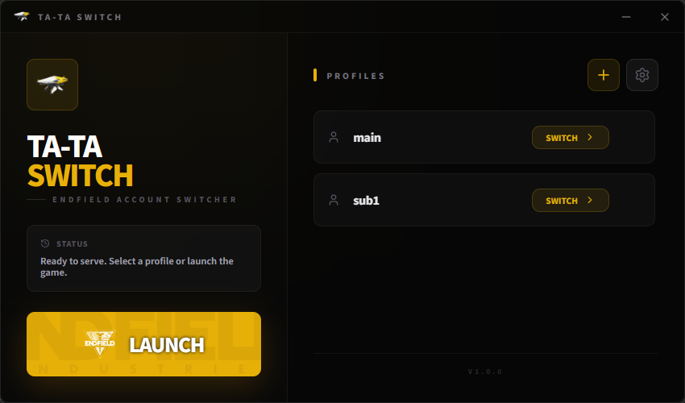
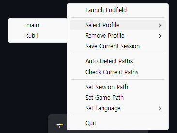

## 기존 아키텍처의 문제





초기 버전의 데스크톱 앱은 **Tauri**와 **React** 기반으로 개발되었다. 특정 게임 클라이언트의 로컬 세션 파일(`gf_login_cache`)을 백업하고 교체하는 것이 프로그램의 핵심 로직이다.


Tauri는 Electron에 비해 가볍지만, UI 렌더링을 위해 OS 네이티브 웹뷰 프로세스를 필수적으로 띄워야 한다. 백그라운드에 상주하며 클릭 몇 번으로 단순한 파일 I/O만 수행하는 유틸리티에 자바스크립트 파싱, 가상 DOM 렌더링, 프론트엔드와 백엔드 간의 지속적인 IPC(Inter-Process Communication) 통신 오버헤드가 발생하는 것은 명백한 구조적 낭비이자 오버엔지니어링이라 생각했고, 무거운 웹뷰를 제거하고 순수 네이티브 트레이 앱으로 리팩토링을 진행했다.


## 네이티브 아키텍처 전환 및 기술 스택


웹 생태계 의존성을 완전히 제거하고, Windows 운영체제 환경에 최적화된 단일 Rust 바이너리로 아키텍처를 전면 개편했다.

- **UI/UX 단순화**: `tray-icon` 크레이트를 활용해 시스템 트레이 기반의 컨텍스트 메뉴로 조작을 일원화했다. 렌더링 스레드의 개입을 최소화했다.
- **네이티브 GUI 렌더링**: 프로필 추가 창이나 폴더 선택 등 필수적인 인터랙션은 `native-windows-gui` (nwg) 크레이트를 적용하여 Windows 네이티브 API로 직접 다이얼로그를 호출한다.
- **동시성 제어**: 메인 루프 블로킹을 방지하기 위해 팝업 다이얼로그는 `std::thread::spawn`을 통해 별도 스레드로 분리하고, `std::sync::mpsc` 채널을 이용해 메인 트레이 UI의 메뉴 갱신을 안전하게 트리거한다.

## 핵심 로직 구현


### 프로세스 감지를 통한 파일 I/O 안정성 확보


실행 중인 게임 클라이언트를 무시한 채 단순 덮어쓰기를 시도하면 파일 락(File Lock) 충돌이 발생하거나 세션 데이터가 완전히 손상될 위험이 있다. 이를 방지하기 위해 `sysinfo` 크레이트를 사용하여 타겟 프로세스의 런타임 상태를 검증하는 보호 기법을 적용했다.


```rust
use sysinfo::{System, ProcessRefreshKind, RefreshKind, ProcessesToUpdate};

// 타겟 프로세스(endfield.exe) 실행 여부 동적 검증
pub fn is_game_running() -> bool {
    let mut sys = System::new_with_specifics(
        RefreshKind::nothing().with_processes(ProcessRefreshKind::everything())
    );
    // 시스템 전체 프로세스 목록 갱신
    sys.refresh_processes_specifics(ProcessesToUpdate::All, true, ProcessRefreshKind::everything());
    
    for process in sys.processes().values() {
        if process.name().to_string_lossy().to_lowercase().contains("endfield.exe") {
            return true; // 실행 중일 경우 파일 제어 차단
        }
    }
    false
}
```


### 세션 파일 교체 로직


계정 전환 시, 타겟 게임이 인증에 사용하는 **캐시 파일과 무결성 검증용 CRC 파일**을 복사하여 정합성을 유지한다. 로직 처리 후에는 전역 상태 모델인 `Lazy<Mutex<Option<String>>>`을 업데이트하여 현재 활성화된 계정을 추적한다.


```rust
// 게임이 종료된 상태에서만 대상 세션 파일 교체 실행
pub fn load_account_session(session_path: &str, account_name: &str) -> Result<(), String> {
    if is_game_running() {
        return Err("Cannot switch profiles while game is running. Please close Endfield first.".to_string());
    }
    
    let backups_dir = get_backups_dir();
    let account_dir = backups_dir.join(account_name);
    let target_base = Path::new(session_path);
    
    // 타겟 캐시 데이터와 CRC 무결성 파일 페어(Pair) 지정
    let files_to_copy = ["gf_login_cache", "gf_login_cache.crc"];
    
    for file in files_to_copy {
        let src = account_dir.join(file);
        let dst = target_base.join(file);
        if src.exists() {
            fs::copy(&src, &dst).map_err(|e| e.to_string())?;
        }
    }
    
    // 메모리 상의 활성 계정 상태 갱신
    set_active_account(Some(account_name.to_string()));
    Ok(())
}
```


### 레지스트리 기반 런타임 경로 탐지


사용자가 수동으로 폴더를 지정하는 불편함을 해소하기 위해 `winreg` 크레이트로 Windows 레지스트리를 스캔하는 동적 탐지 기능을 구현했다.


네이티브 런처(GRYPHLINK) 및 Epic Games 등 다양한 설치 환경을 대응하기 위해 `Uninstall` 레지스트리의 `InstallLocation` 및 `UninstallString` 키를 역추적하여 실제 실행 파일(`Endfield.exe`)의 절대 경로를 안전하게 파악한다.


## 리팩토링 결과




- **메모리 오버헤드 원천 제거**: 백그라운드 대기 시 과도한 메모리를 점유하던 웹뷰 프로세스와 JS 런타임이 완전히 제거되며, 메모리 사용량이 수백 MB에서 **약 3 MB의 네이티브 수준**으로 대폭 최적화되었다.
- **프로세스 안정성 확보**: 단순 UI 프레임워크 교체를 넘어, 타겟 프로세스 실행 여부 감지 로직을 추가하여 I/O 작업 중 발생할 수 있는 크래시를 차단했다.
- **구조적 적합성 달성**: 백그라운드 시스템 유틸리티는 시각적 화려함보다 리소스 최소화가 핵심이다. 이번 리팩토링을 통해 구현할 로직의 크기보다 프레임워크가 비대해지는 설계를 경계해야 함을 느끼게 됐다.
